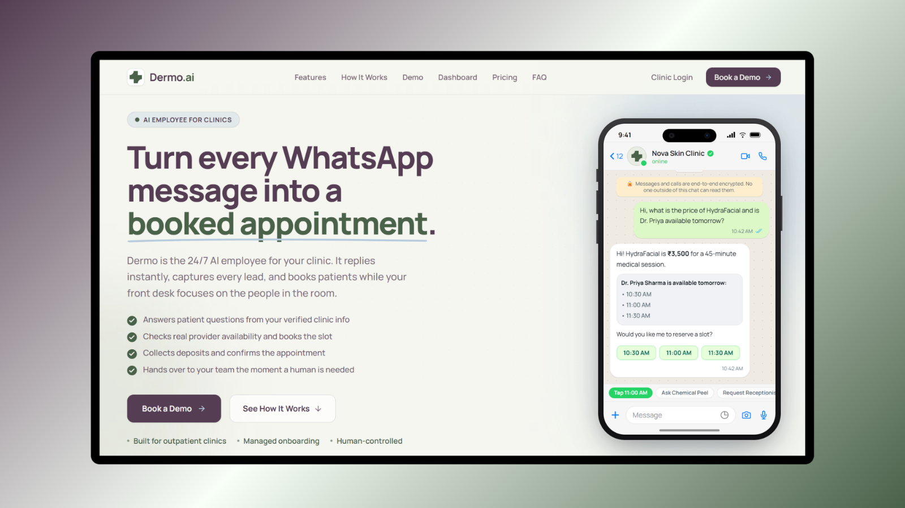

# Dermoai — 24/7 Autonomous AI Employee for Modern Clinics

# Tech Stack

---

## 📌 Executive Summary

**Dermoai** solves this by acting as an autonomous, always-on **digital receptionist and patient coordinator**. Operating directly over **WhatsApp**—the primary messaging channel for outpatient clinics worldwide—Dermo greets patients instantly, answers treatment and pricing questions from verified clinic knowledge, checks live physician calendars, collects reservation deposits via integrated payment links, and intelligently escalates complex or clinical inquiries to human staff.

## ✨ Core Capabilities

### 1. 💬 Omnichannel WhatsApp Automation
* Native integration with the **Meta WhatsApp Cloud API**.
* Handles multimedia, quick reply buttons, list messages, and natural conversational text.
* Zero delay: Responds in under 2.5 seconds with warm, brand-tailored conversational tone.

### 2. 🧠 Context-Aware Healthcare RAG (`pgvector`)
* Embeds and semantically indexes verified clinic documentation: services, doctor credentials, contraindications, preparation tips, and fee schedules.
* Uses semantic distance thresholding: if confidence is below safety boundaries, the system transparently defers to clinic staff rather than guessing.

### 3. 🗓️ Deterministic Appointment & Calendar Engine
* Strict two-phase reservation pipeline (`Check Availability` $\rightarrow$ `Soft Hold` $\rightarrow$ `Payment Commit`).
* Enforces doctor shift times, room constraints, buffer windows, and procedure durations.
* Completely immune to LLM hallucination: slots are fetched directly from PostgreSQL calendar tables.

### 4. 💳 Frictionless In-Chat Payment Collection
* Automated **Razorpay** integration creates secure payment links inside the WhatsApp conversation.
* Collects consultation deposits (e.g., ₹500) to deter no-shows.
* Instant reconciliation via webhooks: slots are confirmed upon webhook verification.

### 5. 🤝 Seamless Human-in-the-Loop Takeover
* One-click toggle (`AI_MODE` $\leftrightarrow$ `HUMAN_TAKEOVER`).
* Receptionists can take over the conversation anytime from the web dashboard; the AI immediately pauses automated replies.
* Once the staff finishes, the conversation can be handed back to AI mode seamlessly.

### 6. 🔐 Enterprise Authentication & Multi-Tenant Foundations
* Built with **Better Auth** using server-side, HTTP-only secure cookie sessions.
* Email/Password credential authentication with robust password hashing and rate limiting.
* Social OAuth providers (Google, GitHub) pre-configured.
* Strict tenant isolation boundaries (`clinic_id`) across all database queries.

## ⚡ Engineering Depth & Technical Innovations

### 1. Robust Webhook Idempotency
WhatsApp delivers webhook notifications under an "at-least-once" guarantee. To prevent duplicate replies or double bookings, Dermo indexes incoming `message_id` hashes in a fast Redis cache with a TTL of 24 hours. Duplicate deliveries are immediately acknowledged (`200 OK`) and discarded.

### 2. Guardrailed Tool Execution (Deterministic Isolation)
The Large Language Model is strictly treated as an intent interpreter. When a patient says *"Book Dr. Priya at 11am"*:
1. The LLM extracts the parameter schema `{ doctor: "Dr. Priya", time: "11:00", date: "2026-10-01" }`.
2. The schema is validated against a **Zod** validator.
3. The booking service executes an ACID transaction on PostgreSQL with `SELECT ... FOR UPDATE` row-level locks.
4. The LLM receives the outcome string and converts it into conversational confirmation.

### 3. Sub-Second Hybrid Search
Clinic documents (services, post-care instructions, pricing, doctor bios) are pre-chunked with overlap and converted into dense vector embeddings. Search queries execute hybrid cosine-similarity queries through `pgvector` indexed via `HNSW` (Hierarchical Navigable Small World) for sub-10ms retrieval latency.

## 👤 Author & Contact

**Sultan**  
*Full-Stack Engineer & AI Systems Developer*  

* **GitHub**: [@sultanxdev](https://github.com/sultanxdev)

---

