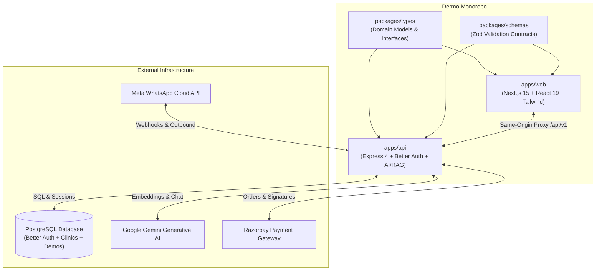
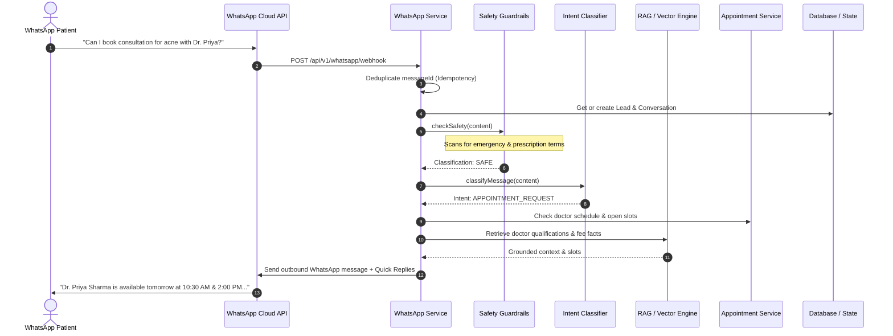
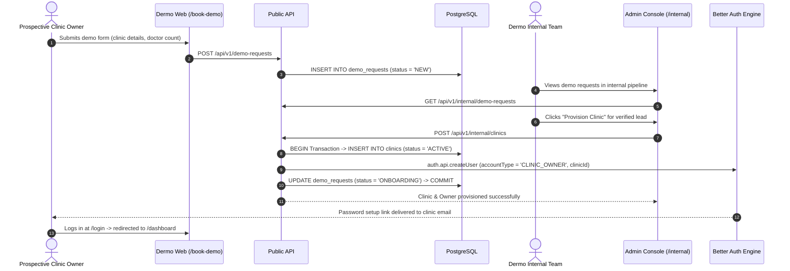
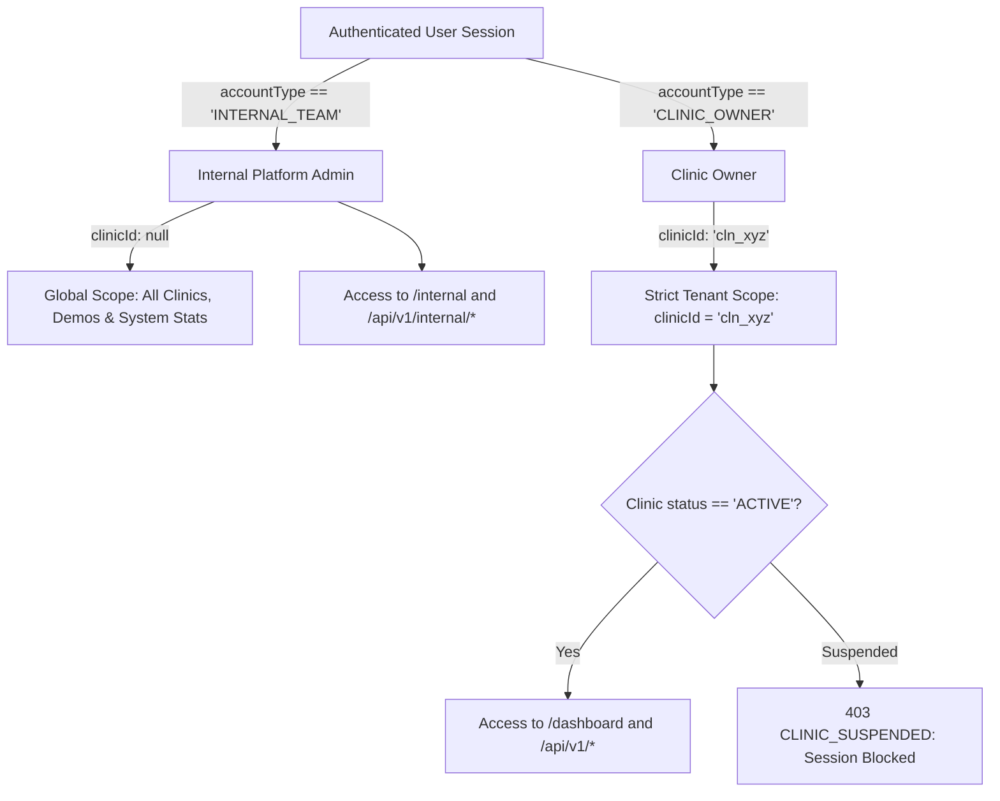
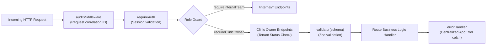
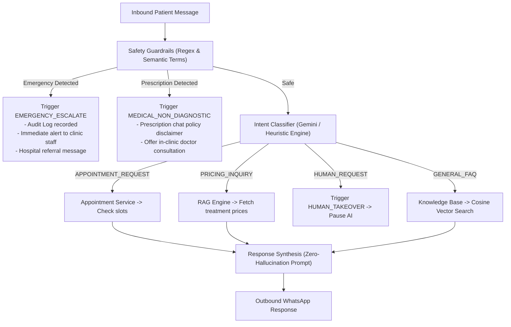

# Dermo — Complete Codebase Architecture & Technical Analysis

> **Platform Version**: Dermo Monorepo v1.0.0  
> **Scope**: `apps/api`, `apps/web`, `packages/types`, `packages/schemas`, PostgreSQL, Better Auth, AI/RAG Pipeline.

---

## 1. Executive System Overview

**Dermo** is a managed AI employee platform specifically engineered for dermatology, aesthetic, and cosmetic clinics. It operates as a high-reliability patient communication, triage, and scheduling bridge across WhatsApp and web channels, backed by human oversight and clinic management workspaces.

### Core Capabilities
1. **WhatsApp Patient Agent**: Handles inquiries, provides grounded pricing and procedure details, checks real-time doctor availability, and schedules appointments.
2. **Clinical Safety Guardrails**: Non-diagnostic filters that intercept drug prescription requests (e.g., Accutane/Isotretinoin, steroids) and escalate emergencies (e.g., anaphylaxis, severe reactions) directly to human clinic staff.
3. **Human Takeover Console**: Allows receptionists and clinic coordinators to silently monitor AI chats and seamlessly pause AI with 1-click takeover.
4. **Deposit & Payment Collection**: Integrated Razorpay order generation and webhook payment verification for consultation deposits.
5. **Multi-Tenant Operations**: Platform-level internal team console (`/internal`) for reviewing demo requests, provisioning clinic instances, and activating/suspending clinic accounts.

---

## 2. High-Level Architecture & Monorepo Topology

Dermo is structured as a TypeScript monorepo using npm workspaces:



### Workspace Directory Layout
```text
dermo/
├── apps/
│   ├── api/                           # Backend API server (Port 4000)
│   │   ├── src/
│   │   │   ├── ai/                    # Gemini RAG, Intent Classifier, Safety Guardrails, Vector Store
│   │   │   ├── auth/                  # Better Auth configuration & PostgreSQL Pool
│   │   │   ├── config/                # Environment variables & runtime settings
│   │   │   ├── database/              # Schema definitions, seeders, in-memory repository
│   │   │   ├── middleware/            # requireAuth, requireClinicOwner, audit, validator
│   │   │   ├── routes/                # Express REST endpoint modules
│   │   │   ├── services/              # WhatsApp, Appointments, Leads, Payments
│   │   │   ├── app.ts                 # Express application initialization
│   │   │   └── server.ts              # HTTP listener
│   │   └── test/                      # 52 integration and unit tests (Node test runner)
│   └── web/                           # Frontend web application (Port 3000)
│       ├── src/
│       │   ├── app/
│       │   │   ├── (marketing)/       # Public pages: /, /features, /pricing, /faq, /book-demo
│       │   │   ├── (auth)/            # Auth pages: /login, /forgot-password, /reset-password, /verify-email
│       │   │   ├── dashboard/         # Clinic Workspace: appointments, leads, chats, doctors, settings
│       │   │   └── internal/          # Platform Admin Console: clinic provisioning & demo management
│       │   ├── components/            # Luxury clinical UI components & icon system
│       │   ├── features/              # Feature modules (demo actions, booking forms)
│       │   ├── lib/                   # Typed API client & Better Auth browser client
│       │   └── middleware.ts          # Session protection & canonical route redirects
├── packages/
│   ├── types/                         # Shared TypeScript domain types
│   └── schemas/                       # Shared Zod validation schemas
├── docs/                              # Architecture, SRS, and API documentation
└── package.json                       # Root monorepo workspace configuration
```

---

## 3. End-to-End Data & Execution Flows

### 3.1 Inbound WhatsApp Patient Journey



### 3.2 Public Demo Request to Clinic Provisioning Flow



---

## 4. Multi-Tenant Architecture & Invariants

Dermo implements strict **two-tier multi-tenancy** enforced at database, API middleware, and front-end routing layers.



### Invariant Rules
1. **Internal Team Isolation**: Accounts with `accountType: 'INTERNAL_TEAM'` have `clinicId = null`. They are barred from clinic tenant operations but have exclusive clearance to provision clinics, audit platform metrics, and suspend workspaces.
2. **Clinic Owner Tenant Pinning**: Accounts with `accountType: 'CLINIC_OWNER'` **must** possess a valid, non-null `clinicId`. All patient data, appointments, services, and doctor profiles are strictly scoped to that `clinicId`.
3. **Immediate Suspension Enforcement**: Unlike naive JWT token architectures where revoked accounts remain active until expiry, `requireClinicOwner` middleware executes a direct PostgreSQL query:
   ```sql
   SELECT status FROM clinics WHERE id = $1
   ```
   If a clinic is suspended by the platform team, every request from the clinic owner is immediately rejected with HTTP `403 CLINIC_SUSPENDED`.

---

## 5. Database Schema & Data Models

### 5.1 PostgreSQL Relational Tables (Source of Truth)

#### `clinics`
Platform clinic tenant entities.
```sql
CREATE TABLE clinics (
    id VARCHAR(64) PRIMARY KEY,
    source_demo_request_id VARCHAR(64) REFERENCES demo_requests(id),
    name VARCHAR(255) NOT NULL,
    slug VARCHAR(100) UNIQUE NOT NULL,
    email VARCHAR(255) NOT NULL,
    phone VARCHAR(50) NOT NULL,
    address TEXT,
    city VARCHAR(100),
    timezone VARCHAR(50) DEFAULT 'Asia/Kolkata',
    currency VARCHAR(10) DEFAULT 'INR',
    status VARCHAR(30) DEFAULT 'ACTIVE',             -- 'ACTIVE', 'SUSPENDED', 'ARCHIVED'
    onboarding_status VARCHAR(30) DEFAULT 'CONFIGURING', -- 'CONFIGURING', 'TESTING', 'READY', 'LIVE'
    created_at TIMESTAMP WITH TIME ZONE DEFAULT NOW(),
    updated_at TIMESTAMP WITH TIME ZONE DEFAULT NOW()
);
```

#### `demo_requests`
Inbound prospective clinic leads submitted via `/book-demo` or interactive modals.
```sql
CREATE TABLE demo_requests (
    id VARCHAR(64) PRIMARY KEY,
    name VARCHAR(255) NOT NULL,
    clinic_name VARCHAR(255) NOT NULL,
    email VARCHAR(255) NOT NULL,
    phone VARCHAR(50) NOT NULL,
    clinic_type VARCHAR(100),
    doctor_count INTEGER DEFAULT 1,
    city VARCHAR(100),
    requirements TEXT,
    status VARCHAR(30) DEFAULT 'NEW', -- 'NEW', 'REVIEWED', 'SCHEDULED', 'COMPLETED', 'ONBOARDING', 'ARCHIVED'
    created_at TIMESTAMP WITH TIME ZONE DEFAULT NOW(),
    updated_at TIMESTAMP WITH TIME ZONE DEFAULT NOW()
);
```

#### Better Auth Tables (`user`, `session`, `account`, `verification`)
Managed natively by Better Auth on PostgreSQL:
- **`user`**: `id`, `name`, `email`, `emailVerified`, `image`, `accountType` (`'INTERNAL_TEAM' | 'CLINIC_OWNER'`), `clinicId` (foreign reference to `clinics.id`), `createdAt`, `updatedAt`.
- **`session`**: `id`, `userId`, `token`, `expiresAt`, `ipAddress`, `userAgent`, `createdAt`, `updatedAt`.
- **`account`**: Authentication provider credentials and hashed passwords.
- **`verification`**: Email verification and password reset challenge nonces.

---

### 5.2 Domain Models & Clinic Entities (`packages/types`)

| Entity | Primary Fields | Purpose |
| :--- | :--- | :--- |
| **`Doctor`** | `id`, `clinicId`, `name`, `specialty[]`, `schedule[]`, `consultationFee` | Doctor profile, active days, slot duration, and lunch break parameters. |
| **`Service`** | `id`, `clinicId`, `name`, `category`, `price`, `depositRequired`, `benefits[]` | Clinical treatments (HydraFacial, Carbon Peel, PRP, Botox, Fillers) with pricing and prep guidelines. |
| **`Lead`** | `id`, `clinicId`, `phone`, `name`, `status`, `intent`, `budget` | Patient inquiry lifecycle (`NEW`, `QUALIFIED`, `APPOINTMENT_BOOKED`, `LOST`). |
| **`Appointment`**| `id`, `clinicId`, `doctorId`, `serviceId`, `date`, `startTime`, `endTime`, `status` | Booking lifecycle (`PENDING_PAYMENT`, `CONFIRMED`, `COMPLETED`, `CANCELLED`, `RESCHEDULED`). |
| **`Conversation`** | `id`, `clinicId`, `patientPhone`, `state`, `mode`, `unreadCount` | Conversation state machine (`START`, `QUALIFICATION`, `BOOKING`, `HANDOFF`) and control mode (`AI` vs `HUMAN_TAKEOVER`). |
| **`WhatsAppMessage`** | `id`, `conversationId`, `providerMessageId`, `direction`, `sender`, `content` | Immutable chat transcript log (`INBOUND` from patient, `OUTBOUND` from AI or staff). |
| **`KnowledgeDoc`** | `id`, `clinicId`, `title`, `content`, `category`, `isApproved` | Approved clinical documents chunked and indexed into the vector store for RAG grounding. |
| **`RazorpayOrder`** | `id`, `clinicId`, `orderId`, `amount`, `currency`, `status` | Consultation deposits and treatment pre-payment orders with cryptographic signature validation. |

---

## 6. API Specification & Security Pipeline

All API routes are mounted under `/api/v1` on Express.



### Complete Route Catalog

| Category | Method | Path | Auth / Role | Description |
| :--- | :--- | :--- | :--- | :--- |
| **Public / Demo** | `POST` | `/api/v1/demo-requests` | Public | Submits clinic demo request from marketing site. |
| **Public / Webhook**| `GET` | `/api/v1/whatsapp/webhook` | Public | Meta verification challenge (`hub.challenge`). |
| **Public / Webhook**| `POST`| `/api/v1/whatsapp/webhook` | Meta Secret / Idempotent | Inbound WhatsApp message processor. |
| **Auth** | `*` | `/api/auth/*` | Better Auth | Session authentication, sign-in, sign-out, session checks. |
| **Clinic Tenant** | `GET` | `/api/v1/clinic` | `requireAuth` | Retrieves current clinic configuration and metadata. |
| **Clinic Tenant** | `PATCH`| `/api/v1/clinic` | `requireClinicOwner` | Updates clinic operating hours, contact info, and settings. |
| **Doctors** | `GET` | `/api/v1/doctors` | `requireAuth` | Lists doctors with their specialties and schedules. |
| **Doctors** | `POST`| `/api/v1/doctors` | `requireClinicOwner` | Adds a doctor profile and schedule parameters. |
| **Availability** | `GET` | `/api/v1/appointments/availability` | `requireAuth` | Computes available slots for a doctor on a given date. |
| **Appointments** | `GET` | `/api/v1/appointments` | `requireAuth` | Lists clinic appointments with filtering. |
| **Appointments** | `POST`| `/api/v1/appointments` | `requireAuth` | Atomically reserves an appointment slot. |
| **Appointments** | `POST`| `/api/v1/appointments/:id/reschedule`| `requireAuth` | Reschedules an existing appointment to a new slot. |
| **Appointments** | `POST`| `/api/v1/appointments/:id/cancel` | `requireAuth` | Cancels appointment and releases slot. |
| **Conversations** | `GET` | `/api/v1/conversations` | `requireAuth` | Lists patient WhatsApp conversations. |
| **Conversations** | `POST`| `/api/v1/conversations/:id/takeover` | `requireAuth` | Pauses AI and activates human staff takeover. |
| **Conversations** | `POST`| `/api/v1/conversations/:id/release` | `requireAuth` | Releases human takeover back to automated AI mode. |
| **Conversations** | `POST`| `/api/v1/conversations/:id/messages`| `requireAuth` | Sends staff message to patient via WhatsApp. |
| **Knowledge** | `GET` | `/api/v1/knowledge/documents` | `requireAuth` | Lists approved clinic documents. |
| **Knowledge** | `POST`| `/api/v1/knowledge/documents` | `requireClinicOwner` | Uploads doc, chunks text, and computes vector embeddings. |
| **Payments** | `POST`| `/api/v1/payments/create-order` | `requireAuth` | Generates a Razorpay payment order for consultation deposit. |
| **Payments** | `POST`| `/api/v1/payments/verify` | `requireAuth` | Verifies cryptographic HMAC-SHA256 Razorpay signature. |
| **Internal Admin**| `GET` | `/api/v1/internal/stats` | `requireInternalTeam`| Aggregates platform clinic counts and demo pipeline stats. |
| **Internal Admin**| `GET` | `/api/v1/internal/clinics` | `requireInternalTeam`| Lists all registered clinic tenants. |
| **Internal Admin**| `POST`| `/api/v1/internal/clinics` | `requireInternalTeam`| Provisions new clinic workspace and creates owner account. |
| **Internal Admin**| `PATCH`| `/api/v1/internal/clinics/:id/status`| `requireInternalTeam`| Sets clinic status (`ACTIVE`, `SUSPENDED`, `ARCHIVED`). |
| **Internal Admin**| `GET` | `/api/v1/internal/demo-requests` | `requireInternalTeam`| Retrieves incoming clinic demo requests. |
| **Internal Admin**| `PATCH`| `/api/v1/internal/demo-requests/:id/status`| `requireInternalTeam`| Transitions demo request status (`SCHEDULED`, `COMPLETED`). |

---

## 7. AI Engine & Clinical Safety Framework

### 7.1 Multi-Tier Intent & Safety Architecture



### 7.2 Safety Terms Catalog (`safetyGuard.ts`)
- **Emergency Terms**: `severe allergic reaction`, `anaphylaxis`, `bleeding heavily`, `chemical burn on eyes`, `throat closing`, `difficulty breathing`, `extreme swelling`.
- **Prescription Terms**: `isotretinoin`, `accutane`, `tretinoin`, `antibiotic`, `steroid`, `prednisone`, `minoxidil`, `finasteride`, `hydroquinone`, `doxycycline`, `clindamycin`, `prescription`, `dosage`.
- **Diagnostic Symptoms**: `is this skin cancer`, `melanoma`, `mole changing color`, `bleeding mole`, `severe infection`, `pus discharge`.

### 7.3 Resilient Two-Tier Vector & RAG Fallback
1. **Tier 1 (Gemini AI)**: Generates 768-dimensional embeddings via `text-embedding-004` and conversational completions via `gemini-1.5-flash`.
2. **Tier 2 (Offline Deterministic Fallback)**: If `GEMINI_API_KEY` is not present or an upstream network outage occurs, the engine automatically falls back to a 64-dimensional bag-of-words vector space with cosine similarity and deterministic structured fact lookups. The application never crashes or goes silent.

---

## 8. Authentication & Session Architecture

### Better Auth Configuration
- **Session Duration**: 7 days rolling window (`expiresIn: 604800` seconds).
- **Session Cookie Cache**: Explicitly disabled (`cookieCache: { enabled: false }`) to ensure immediate, zero-latency enforcement if a clinic is suspended.
- **Cookie Prefix**: `dermo` (producing `dermo.session_token`).
- **Public Signup**: Disabled (`disableSignUp: true`). Accounts are provisioned exclusively through `/internal` platform clearance.

### Next.js Route Protection (`middleware.ts`)
Next.js Edge Middleware intercepts all navigation:
```typescript
// Guard clinic dashboard
if (isOnDashboard && !hasSession) {
  return NextResponse.redirect(new URL('/login', request.url));
}

// Guard internal operations console
if (isOnInternal && !hasSession) {
  return NextResponse.redirect(new URL('/login', request.url));
}

// Canonicalize legacy auth URLs
if (pathname === '/auth/login' || pathname === '/auth') {
  return NextResponse.redirect(new URL('/login', request.url));
}
if (pathname === '/auth/signup') {
  return NextResponse.redirect(new URL('/book-demo', request.url));
}
```

---

## 9. Frontend Architecture & Design System

### 9.1 Luxury Clinical Design Tokens
The user interface adheres to a calm, high-end medical aesthetic avoiding bright neon accents or generic corporate blues:

| Token Name | Hex Code | Purpose |
| :--- | :--- | :--- |
| **Canvas Background** | `#F5F6F0` | Warm, organic alabaster canvas; eliminates harsh glare. |
| **Primary Aubergine** | `#553E53` | Refined deep plum/aubergine for headings, active tabs, and primary buttons. |
| **Mineral Accent** | `#B6CBDE` | Muted slate blue for subtle borders, badges, and focus rings. |
| **Forest Sage** | `#4B624A` | Earthy sage green for success indicators, active badges, and confirmation states. |
| **Typography** | `Manrope`, sans-serif | High-legibility, geometric modern typeface for clinical data and tables. |

### 9.2 Route Groups in App Router
- **`(marketing)`**: Landing page (`/`), Features (`/features`), Pricing (`/pricing`), FAQ (`/faq`), and Demo booking (`/book-demo`). Uses lightweight layout with marketing navbar and footer.
- **`(auth)`**: Sign-in (`/login`), Forgot password (`/forgot-password`), Password reset (`/reset-password`), and Email verification (`/verify-email`). Uses centered minimalist card layout.
- **`/dashboard`**: Full-fledged clinic operations portal with sidebar navigation:
  - `/dashboard`: Real-time KPI stats, recent inquiries, appointment queue.
  - `/dashboard/conversations`: WhatsApp chat stream with live AI/Staff toggle.
  - `/dashboard/appointments`: Doctor calendar and booking manager.
  - `/dashboard/leads`: Patient acquisition pipeline.
  - `/dashboard/doctors`: Doctor roster and schedule editor.
  - `/dashboard/services`: Clinic catalog and deposit configuration.
  - `/dashboard/knowledge`: RAG document indexer.
  - `/dashboard/payments`: Razorpay transactions log.
  - `/dashboard/whatsapp`: Meta Cloud API simulator and connection status.
- **`/internal`**: Dermo operations console for platform administrators with demo triage pipeline, clinic list, and automated provisioning wizard.

---

## 10. Verification, Testing & Tooling Reference

### 10.1 Test Suite Summary (`npm test` in `apps/api`)
The test suite consists of **52 automated unit and integration tests** across 13 suites:
1. `authProtection.test.ts`: Unauthenticated session rejection and cookie verification.
2. `internalProtection.test.ts`: Role-based isolation of internal provisioning endpoints.
3. `tenantIsolation.test.ts`: Verification that clinic owners cannot read data from other clinics.
4. `sessionPersistence.test.ts`: PostgreSQL session retrieval and sliding expiration.
5. `apiProtection.test.ts`: Route protection across all clinical sub-routes.
6. `vectorStore.test.ts`: Document chunking, cosine similarity, and RAG retrieval.
7. `whatsappWebhook.test.ts`: Meta challenge verification and message deduplication.
8. `appointmentScheduling.test.ts`: Atomic conflict-free booking, break validation, and cancellations.
9. `conversationStateMachine.test.ts`: Human takeover pause and AI resumption.
10. `leadManagement.test.ts`: Lead lifecycle transitions (`NEW` $\rightarrow$ `APPOINTMENT_BOOKED`).
11. `medicalSafety.test.ts`: Prescription interception and emergency triage escalation.
12. `zodSchemas.test.ts`: Contract validation for all domain schemas.

### 10.2 Monorepo Commands
```bash
# Install all dependencies across workspaces
npm install

# Run backend API tests (52 tests)
npm test

# Type-check all packages
npm run type-check

# Build backend and frontend
npm run build

# Start development servers concurrently
npm run dev

# Seed database with sample clinic, doctors, and treatments
npm run seed
```

---

## 11. Architectural Summary & Health Scorecard

| Domain | Architecture Status | Observations & Notes |
| :--- | :---: | :--- |
| **Type Safety** | 100% (Strict) | Shared monorepo packages (`@dermo/types`, `@dermo/schemas`) eliminate schema drift between API and Web. |
| **Data Integrity** | High | PostgreSQL transactions (`BEGIN`/`COMMIT`) ensure atomic clinic provisioning and demo linking. |
| **Fault Tolerance** | High | Two-tier AI design ensures the platform continues functioning seamlessly even without external LLM connectivity. |
| **Security Posture** | Production-Grade | Real-time database suspension checks, strict Better Auth cookie configuration, and zero client-side credential injection. |
| **Aesthetics & UX** | World-Class | Curated luxury clinical design system (`#F5F6F0`, `#553E53`, `#4B624A`) delivering a premium experience. |
